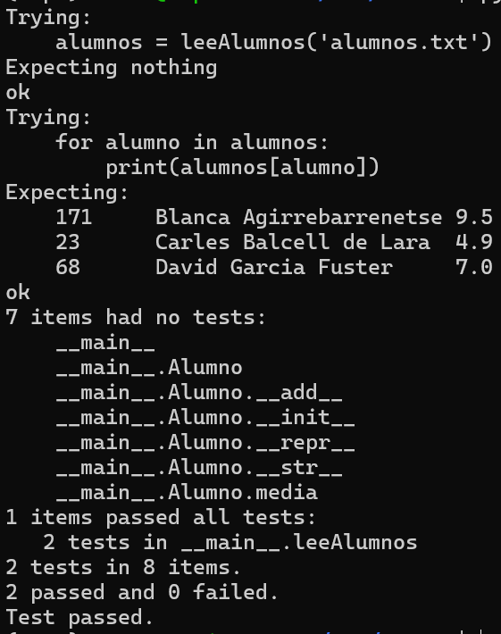
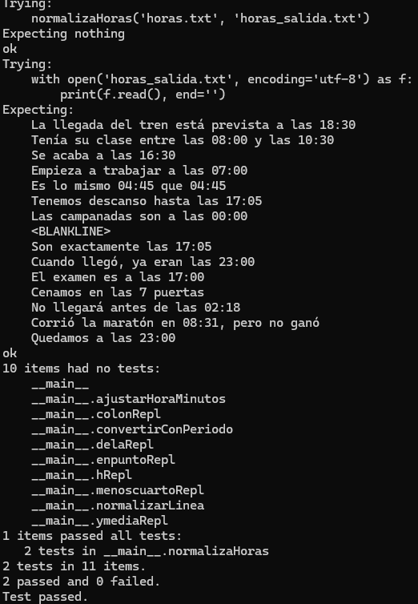

# Expresiones Regulares

## Nom i cognoms

> [!Important]
> Introduzca a continuación su nombre y apellidos:
>
> Saül Muñoz Rodríguez

## Aviso Importante

> [!Caution]
> 
> El objetivo de esta tarea es aprender a usar las expresiones regulares. En concreto, su
> implementación en Python. A los profesores de la asignatura les importa un pimiento si
> usted conoce alguna biblioteca que hace el mismo trabajo de manera más sencilla y/o
> eficiente; su uso está prohibido.
>
> ¿Quiere saber más?, consulte con el profesorado.

## Fecha de entrega: 7 de junio a medianoche

## Tratamiento de ficheros de notas

Con el final de curso llega la ardua tarea de evaluar las tareas realizadas por los alumnos durante el
mismo. Para facilitar esta tarea, se dispone de la clase `Alumno` que proporciona los datos
fundamentales de cada alumno: su número de identificación (`numIden`), su nombre completo 
(`nombre`) y la lista de notas obtenidas a lo largo del curso (`notas`). La clase también
proporciona métodos para añadir una nota al expediente del alumno (`__add__()`), para obtener
la representación *oficial* del mismo (`__repr__()`) y para obtener la representación
*bonita* (`__str__()`).

La definición de la clase `Alumno`, disponible en `alumno.py`, es:

```python
class Alumno:
    """
    Clase usada para el tratamiento de las notas de los alumnos. Cada uno
    incluye los atributos siguientes:

    numIden:   Número de identificación. Es un número entero que, en caso
               de no indicarse, toma el valor por defecto 'numIden=-1'.
    nombre:    Nombre completo del alumno.
    notas:     Lista de números reales con las distintas notas de cada alumno.
    """

    def __init__(self, nombre, numIden=-1, notas=[]):
        self.numIden = numIden
        self.nombre = nombre
        self.notas = [nota for nota in notas]

    def __add__(self, other):
        """
        Devuelve un nuevo objeto 'Alumno' con una lista de notas ampliada con
        el valor pasado como argumento. De este modo, añadir una nota a un
        Alumno se realiza con la orden 'alumno += nota'.
        """
        return Alumno(self.nombre, self.numIden, self.notas + [other])

    def media(self):
        """
        Devuelve la nota media del alumno.
        """
        return sum(self.notas) / len(self.notas) if self.notas else 0

    def __repr__(self):
        """
        Devuelve la representación 'oficial' del alumno. A partir de copia
        y pega de la cadena obtenida es posible crear un nuevo Alumno idéntico.
        """
        return f'Alumno("{self.nombre}", {self.numIden!r}, {self.notas!r})'

    def __str__(self):
        """
        Devuelve la representación 'bonita' del alumno. Visualiza en tres
        columnas separas por tabulador el número de identificación, el nombre
        completo y la nota media del alumno con un decimal.
        """
        return f'{self.numIden}\t{self.nombre}\t{self.media():.1f}'
```

A menudo, las notas de los alumnos se almacenan en ficheros de texto en los que los datos de cada alumno
ocupan una línea con los distintos valores separados por espacios y/o tabuladores.

El ejemplo siguiente muestra un fichero típico con las notas de tres alumnos:

```text
171 Blanca Agirrebarrenetse 10  	9 	  9.5
23  Carles Balcell de Lara  5 	    5 	  4.5  	5.2
68  David Garcia Fuster 	7.75    5.25  8   
```

Añada al fichero `alumno.py` la función `leeAlumnos(ficAlum)` que lea un fichero de texto con los datos de 
todos los alumnos y devuelva un diccionario en el que la clave sea el nombre de cada alumno y su contenido 
el objeto `Alumno` correspondiente.

La función deberá cumplir los requisitos siguientes:

- Sólo debe realizar lo que se indica; es decir, debe leer el fichero de texto que se le pasa como único
  argumento y devolver un diccionario con los datos de los alumnos.
- El análisis de cada línea de texto se realizará usando expresiones regulares.
- La función `leeAlumnos()` debe incluir, en su cadena de documentación, la prueba unitaria siguiente según
  el formato de la biblioteca `doctest`, donde el fichero `'alumnos.txt'` es el fichero mostrado como ejemplo
  al principio de este enunciado:

  ```python
  >>> alumnos = leeAlumnos('alumnos.txt')
  >>> for alumno in alumnos:
  ...     print(alumnos[alumno])
  ...
  171     Blanca Agirrebarrenetse 9.5
  23      Carles Balcells de Lara 4.9
  68      David Garcia Fuster     7.0
  ```

  - Evidentemente, es responsabilidad del autor comprobar que la prueba unitaria se pasa satisfactoriamente
    antes de la entrega de la tarea.

  - Para evitar que diferencias debidas a espacios en blanco o tabuladores den lugar a error, se recomienda
    efectuar las pruebas unitarias con la opción `doctest.NORMALIZE_WHITESPACE`. Por ejemplo,
    `doctest.testmod(optionflags=doctest.NORMALIZE_WHITESPACE)`.


## Análisis de expresiones horarias

En casi todos los idiomas más habituales, cualquier hora puede reducirse al formato estándar HH:MM, donde HH es 
un número de dos dígitos, que representa la hora y está comprendido entre 00 y 23, y MM es otro número de dos 
dígitos, que representa el minuto y está comprendido entre 00 y 59.

No obstante, en el lenguaje hablado, es raro usar este formato estándar. En el caso del castellano, existe una
gran variedad de formatos. La lista siguiente alguna de las posibilidades más frecuentes, aunque existen bastantes
más:

- **08:27**

  Es el formato estándar. Cuando la hora es menor que 10, es posible representarla con
  dos dígitos (08:27), o sólo uno (8:27). Los minutos se representan siempre con dos (8:05).

- **8h27m**

  Las horas o minutos menores que 10 pueden representarse usando uno o dos dígitos. Las horas
  *en punto* pueden indicarse sin minutos (8h).

- **8 en punto**

  Las horas exactas suelen indicarse con la partícula *'en punto'*. En ese caso, es
  habitual omitir la letra *h* después de la cifra.

  Otras alternativas semejantes son las *'8 y cuarto'*, las *'8 y media'* o las *'8 menos cuarto'*.

  En todos estos casos, el reloj empleado será de 12 horas y empezando en 1 (de 1 a 12). El
  resultado será ambiguo, ya que no sabremos si una cierta hora es AM o PM, pero así es cómo
  se suele hablar (la gente queda a *'las 11 en punto'* para ir a una fiesta, no a las
  *'las 23 en punto'*). El resultado se devolverá siempre en el rango de 00:00 a 11:59.

- **... de la mañana**

  Las expresiones horarias entre las 4 y las 12 pueden ir seguidas de la partícula *'de la mañana'*.

  Análogamente, las horas entre las 12 y las 3 pueden ir seguidas de *'del mediodía'*, las horas entre
  las 3 y las 8 pueden serlo de *'de la tarde'*, entre 8 y 4 de *'de la noche'* y entre 1 y
  6 de *'de la madrugada'*.

  En estos casos, el reloj empleado es siempre de 12 horas (nunca se dice *'las 18 de la tarde'*, sino
  *'las 6 de la tarde'*). Además la hora no puede ser cero, sino que, en ese caso, se usaría 12.

### Tarea: normalización de las expresiones horarias de un texto

Escriba el fichero `horas.py` con la función `normalizaHoras(ficText, ficNorm)`, que lee el fichero de
texto `ficText`, lo analiza en busca de expresiones horarias y escribe el fichero `ficNorm` en el que
éstas se expresan según el formato normalizado, con las horas y los minutos indicados por dos dígitos
y separados por dos puntos (08:27).

Cada línea del fichero puede contener, o no, una o más expresiones horarias, pero éstas nunca aparecerán
partidas en más de una línea.

Las horas con expresión incorrecta, por ejemplo, *'17:5'* (en la expresión normalizada deben usarse dos
dígitos para expresar los minutos) u *'11 de la tarde'* (la tarde nunca llega hasta esa hora), deben
dejarse tal cual.

Para la evaluación de la tarea se usará un texto con unas cien expresiones horarias, que incluirán tanto
expresiones correctas como incorrectas. Una parte de la nota dependerá de la precisión en su normalización.

Se recomienda empezar normalizando textos que sólo contengan expresiones correctas del tipo más sencillo;
es decir, con la forma *'18h45m'*. La consecución de este objetivo garantiza una nota mínima de notable
bajo (7). La extensión al resto de formatos indicados y la detección de expresiones incorrectas serán
necesarias para alcanzar la nota máxima (10).

La tabla siguiente muestra un ejemplo de texto antes y después de su normalización, incluyendo tanto
expresiones horarias **correctas** como <span style="color:red">**incorrectas**</span>.

### Ejemplo de normalización de las expresiones horarias de un texto

Las líneas siguientes muestran ejemplos de expresiones horarias, tanto correctas como incorrectas. Las
mismas expresiones se encuentran en el fichero `horas.txt`, que puede usar para comprobar el correcto
funcionamiento de su función.

#### Expresiones válidas

> - La llegada del tren está prevista a las **18:30**
> - La llegada del tren está prevista a las **18:30**

> - Tenía su clase entre las **8h** y las **10h30m**
> - Tenía su clase entre las **08:00** y las **10:30**

> - Se acaba a las **4 y media de la tarde**
> - Se acaba a las **16:30**

> - Empieza a trabajar a las **7h de la mañana**
> - Empieza a trabajar a las **07:00**

> - Es lo mismo **5 menos cuarto** que **4:45**
> - Es lo mismo **04:45** que **04:45**

> - Tenemos descanso hasta las **17h5m**
> - Tenemos descanso hasta las **17:05**

> - Las campanadas son a las **12 de la noche**
> - Las campanadas son a las **00:00**

#### Expresiones incorrectas

> - Son exactamente las $\textbf{\color{red}17:5}$
> - Son exactamente las $\textbf{\color{red}17:5}$

> - Cuando llegó, ya eran las $\textbf{\color{red}11 de la tarde}$
> - Cuando llegó, ya eran las $\textbf{\color{red}11 de la tarde}$

> - El examen es a las $\textbf{\color{red}17 de la tarde}$
> - El examen es a las $\textbf{\color{red}17 de la tarde}$

> - Cenamos en las $\textbf{\color{red}7}$ puertas
> - Cenamos en las $\textbf{\color{red}7}$ puertas

> - No llegará antes de las $\textbf{\color{red}1h78m}$
> - No llegará antes de las $\textbf{\color{red}1h78m}$

> - *Corrió* la maratón en $\textbf{\color{red}32h31m}$, pero no ganó
> - *Corrió* la maratón en $\textbf{\color{red}32h31m}$, pero no ganó

> - Quedamos a las $\textbf{\color{red}23 en punto}$
> - Quedamos a las $\textbf{\color{red}23 en punto}$


#### Entrega

##### Ficheros `alumno.py` y `horas.py`

- Ambos ficheros deben incluir una cadena de documentación con el nombre del alumno o alumnos
  y una descripción de su contenido.

- Se valorará lo pythónico de la solución; en concreto, su claridad y sencillez, y el
  uso de los estándares marcados por PEP-ocho.

##### Ejecución de los tests unitarios de `alumno.py`

Inserte a continuación una captura de pantalla que muestre el resultado de ejecutar el
fichero `alumno.py` con la opción *verbosa*, de manera que se muestre el
resultado de la ejecución de los tests unitarios.

Alumnos:



Horas:



##### Código desarrollado

Inserte a continuación los códigos fuente desarrollados en esta tarea, usando los
comandos necesarios para que se realice el realce sintáctico en Python del mismo (no
vale insertar una imagen o una captura de pantalla, debe hacerse en formato *markdown*

Alumnos:

```python
import doctest
import re

def leeAlumnos(ficAlumn):
    """
    Lee un fichero de texto con los datos de los alumnos y devuelve un diccionario 
    en el que la clave es el nombre de cada alumno, el contenido es el objeto Alumno correspondiente.
    ficAlumn: fichero con los objetos Alumno

    Test unitario:

    >>> alumnos = leeAlumnos('alumnos.txt')
    >>> for alumno in alumnos:
    ...     print(alumnos[alumno])
    ...
    171     Blanca Agirrebarrenetse 9.5
    23      Carles Balcell de Lara  4.9
    68      David Garcia Fuster     7.0
    """

    alumnos = {}
    with open(ficAlumn, encoding='utf-8') as f:
        for linea in f:
            linea = linea.strip()
            if not linea:
                continue

            # 1. Capturar el ID (número entero al principio y el espacio que le sigue)
            match_id = re.match(r'(\d+)\s+', linea)
            if not match_id:
                continue
            idAlumno = int(match_id.group(1))
            resto = linea[match_id.end():]   # todo lo que queda después del ID

            # 2. Buscar el primer número (la primera nota) en ese resto
            match_primer_num = re.search(r'\d+(?:\.\d+)?', resto)
            if not match_primer_num:
                continue

            # 3. El nombre es lo que hay antes de ese primer número, quitando espacios al final
            nombre = resto[:match_primer_num.start()].strip()

            # 4. Capturar TODOS los números (notas) desde esa posición en adelante
            notas_str = re.findall(r'\d+(?:\.\d+)?', resto[match_primer_num.start():])
            notas = [float(n) for n in notas_str]

            # 5. Crear el alumno usando argumentos por palabra clave
            alumno = Alumno(nombre=nombre, numIden=idAlumno, notas=notas)
            alumnos[nombre] = alumno

    return alumnos
        


if __name__ == "__main__":
    import doctest
    doctest.testmod(optionflags=doctest.NORMALIZE_WHITESPACE, verbose=True
```

Horas:

```python
"""
Módulo para la normalización de expresiones horarias en un texto.

Este módulo proporciona la función `normalizaHoras` que lee un fichero
de texto, busca todas las expresiones horarias (correctas e incorrectas)
y las convierte al formato normalizado HH:MM, donde las horas y los minutos
se representan con dos dígitos y se separan por dos puntos (ej. 08:27).

Las expresiones horarias que no pueden interpretarse de manera razonable
se mantienen sin cambios.

Formatos reconocidos y su normalización:

- Horas con dos puntos (H:MM o HH:MM): los minutos con un solo dígito se
  completan con un cero a la izquierda (17:5 → 17:05).
- Horas con 'h' y minutos opcionales (Hh, HhMM, HhMMm), con o sin periodo
  del día: se convierten al formato 24 horas si se especifica
  'de la mañana/tarde/noche'.
- Expresiones "y media" y "menos cuarto", que se interpretan como :30 y :45
  respectivamente, también con posibilidad de periodo.
- "H en punto": se trata como hora exacta (:00).
- Periodos del día ('mañana', 'tarde', 'noche'): se convierten al sistema
  de 24 horas de forma flexible, corrigiendo incluso combinaciones
  habituales pero incorrectas como "11 de la tarde" (→ 23:00)
  o "17 de la tarde" (→ 17:00).
- Horas superiores a 23 o minutos superiores a 59 se corrigen realizando
  acarreo o reducción módulo 24 (ej. 32h31m → 08:31, 1h78m → 02:18).

La función principal, `normalizaHoras`, lee el fichero de entrada,
aplica todas las transformaciones y escribe el resultado en el fichero
de salida.
"""

import re
import doctest

def normalizaHoras(ficText, ficNorm):
    """
    Lee un fichero de texto y normaliza sus expresiones horarias.

    Busca en cada línea del fichero `ficText` todas las expresiones horarias
    que sigan alguno de los patrones reconocidos (correctos o con pequeños
    errores) y las convierte al formato estándar HH:MM. El texto resultante
    se guarda en `ficNorm`.

    Args:
        ficText (str): Ruta al fichero de texto de entrada.
        ficNorm (str): Ruta al fichero de texto de salida donde se escribirá
                       el contenido normalizado.

    Returns:
        None: La función no devuelve ningún valor; escribe directamente en
              el fichero `ficNorm`.

    Raises:
        FileNotFoundError: Si el fichero `ficText` no existe.
        PermissionError: Si no se tienen permisos de lectura o escritura.

    Ejemplo de uso:
        >>> normalizaHoras('horas.txt', 'horas_salida.txt')
        >>> with open('horas_salida.txt', encoding='utf-8') as f:
        ...     print(f.read(), end='')
        La llegada del tren está prevista a las 18:30
        Tenía su clase entre las 08:00 y las 10:30
        Se acaba a las 16:30
        Empieza a trabajar a las 07:00
        Es lo mismo 04:45 que 04:45
        Tenemos descanso hasta las 17:05
        Las campanadas son a las 00:00
        <BLANKLINE>
        Son exactamente las 17:05
        Cuando llegó, ya eran las 23:00
        El examen es a las 17:00
        Cenamos en las 7 puertas
        No llegará antes de las 02:18
        Corrió la maratón en 08:31, pero no ganó
        Quedamos a las 23:00

    Nota:
        La función emplea un conjunto de expresiones regulares que se aplican
        en orden, de manera que las transformaciones más específicas se
        realizan antes que las generales. Las partes no horarias del texto
        se mantienen intactas.
    """
    with open(ficText, 'r', encoding='utf-8') as f:
        lineas = f.readlines()
    with open(ficNorm, 'w', encoding='utf-8') as f:
        for linea in lineas:
            linea = normalizarLinea(linea)
            f.write(linea)

def normalizarLinea(linea):
    """Aplica todas las transformaciones de normalización a una línea."""

    # 1. Formato con dos puntos (minutos de 1 o 2 dígitos)
    linea = re.sub(
        r'\b(\d{1,2}):(\d{1,2})\b',
        lambda m: colonRepl(m), linea
    )

    # 2. Formato con 'h', minutos opcionales y periodo opcional
    linea = re.sub(
        r'\b(\d{1,2})h(?:(\d{1,2})m?)?(?:\s*de\s+la\s+(mañana|tarde|noche))?\b',
        lambda m: hRepl(m), linea, flags=re.IGNORECASE
    )

    # 3. "y media"
    linea = re.sub(
        r'\b(\d{1,2})\s+y\s+media(?:\s+de\s+la\s+(mañana|tarde|noche))?\b',
        lambda m: ymediaRepl(m), linea, flags=re.IGNORECASE
    )

    # 4. "menos cuarto"
    linea = re.sub(
        r'\b(\d{1,2})\s+menos\s+cuarto(?:\s+de\s+la\s+(mañana|tarde|noche))?\b',
        lambda m: menoscuartoRepl(m), linea, flags=re.IGNORECASE
    )

    # 5. "de la mañana/tarde/noche" (sin otras partículas)
    linea = re.sub(
        r'\b(\d{1,2})\s+de\s+la\s+(mañana|tarde|noche)\b',
        lambda m: delaRepl(m), linea, flags=re.IGNORECASE
    )

    # 6. "en punto" (con o sin periodo)
    linea = re.sub(
        r'\b(\d{1,2})\s+en\s+punto(?:\s+de\s+la\s+(mañana|tarde|noche))?\b',
        lambda m: enpuntoRepl(m), linea, flags=re.IGNORECASE
    )

    return linea

# ----------------------------------------------------------------------
# Funciones auxiliares de conversión (ahora más permisivas)
# ----------------------------------------------------------------------

def convertirConPeriodo(h, m, periodo):
    """
    Convierte una hora (1-12) y un periodo ('mañana', 'tarde', 'noche')
    a hora en formato 24h.
    Si la hora no encaja en el rango típico del periodo, se aplica una
    corrección flexible:
      - 'mañana': 1-12 -> se deja como está.
      - 'tarde' : suma 12, salvo que h==12 (se deja 12).
      - 'noche' : suma 12 si h != 12; si h==12 se convierte en 0.
    Si h > 12, se ignora el periodo y se devuelve (h, m) directamente.
    Retorna None si el resultado final está fuera de 0-23.
    """
    if h > 12:
        # La hora ya está en formato 24h, ignoramos el periodo
        return (h, m) if h <= 23 else None
    if periodo == 'mañana':
        if 1 <= h <= 12:
            return (h, m)
    elif periodo == 'tarde':
        # En rigor tarde es 1-8, pero si alguien dice "11 de la tarde"
        # lo interpretamos como 23:00 (sumamos 12)
        return ((h + 12) if h != 12 else 12, m)
    elif periodo == 'noche':
        if h == 12:
            return (0, m)
        else:
            return (h + 12, m)
    return None

def ajustarHoraMinutos(h, m):
    """
    Corrige minutos >59 realizando acarreo.
    También reduce la hora módulo 24 si es necesario.
    Retorna (hora, minutos) normalizados.
    """
    horasExtra = m // 60
    m %= 60
    h += horasExtra
    h %= 24
    return h, m

# ----------------------------------------------------------------------
# Reemplazos para cada patrón
# ----------------------------------------------------------------------

def colonRepl(m):
    h = int(m.group(1))
    minutos = int(m.group(2))
    if 0 <= h <= 23 and 0 <= minutos <= 59:
        return f"{h:02d}:{minutos:02d}"
    # Si no, dejamos la expresión original
    return m.group(0)

def hRepl(m):
    h = int(m.group(1))
    minutos = int(m.group(2)) if m.group(2) else 0
    periodo = m.group(3)

    # Si hay periodo, intentamos corregir aunque la hora no esté en el rango original
    if periodo:
        res = convertirConPeriodo(h, 0, periodo)  # primero la hora en punto
        if res is None:
            return m.group(0)
        h24, _ = res
        # Ahora sumamos los minutos (puede haber acarreo)
        hFinal = h24
        mFinal = minutos
        hFinal, mFinal = ajustarHoraMinutos(hFinal, mFinal)
        return f"{hFinal:02d}:{mFinal:02d}"
    else:
        # Sin periodo: aceptamos cualquier hora 0-23, pero si se pasa corregimos
        if h > 23:
            h = h % 24
        h, minutos = ajustarHoraMinutos(h, minutos)
        return f"{h:02d}:{minutos:02d}"

def ymediaRepl(m):
    h = int(m.group(1))
    periodo = m.group(2)
    if periodo:
        res = convertirConPeriodo(h, 0, periodo)
        if res is None:
            return m.group(0)
        h24, _ = res
        # Sumamos 30 minutos, con posible acarreo
        h24, m24 = ajustarHoraMinutos(h24, 30)
        return f"{h24:02d}:{m24:02d}"
    else:
        # Sin periodo, la hora puede ser 1-12 (se asume reloj de 12h) o 0-23
        if 1 <= h <= 12:
            return f"{h:02d}:30"
        elif 0 <= h <= 23:
            # Si es mayor de 12, se asume que ya está en 24h y se le suma 30 min
            h, m = ajustarHoraMinutos(h, 30)
            return f"{h:02d}:{m:02d}"
        return m.group(0)

def menoscuartoRepl(m):
    h = int(m.group(1))
    periodo = m.group(2)
    if periodo:
        res = convertirConPeriodo(h, 0, periodo)
        if res is None:
            return m.group(0)
        h24, _ = res
        totalMinutos = h24 * 60 - 15
        if totalMinutos < 0:
            totalMinutos += 24 * 60
        hNew = totalMinutos // 60
        mNew = totalMinutos % 60
        return f"{hNew:02d}:{mNew:02d}"
    else:
        if 1 <= h <= 12:
            totalMinutos = h * 60 - 15
            if totalMinutos < 0:
                totalMinutos += 24 * 60
            hNew = totalMinutos // 60
            mNew = totalMinutos % 60
            return f"{hNew:02d}:{mNew:02d}"
        elif 0 <= h <= 23:
            totalMinutos = h * 60 - 15
            if totalMinutos < 0:
                totalMinutos += 24 * 60
            hNew = totalMinutos // 60
            mNew = totalMinutos % 60
            return f"{hNew:02d}:{mNew:02d}"
        return m.group(0)

def delaRepl(m):
    h = int(m.group(1))
    periodo = m.group(2)
    res = convertirConPeriodo(h, 0, periodo)
    if res is None:
        return m.group(0)
    h24, m24 = res
    return f"{h24:02d}:{m24:02d}"

def enpuntoRepl(m):
    h = int(m.group(1))
    periodo = m.group(2)
    if periodo:
        res = convertirConPeriodo(h, 0, periodo)
        if res is None:
            return m.group(0)
        h24, m24 = res
        return f"{h24:02d}:{m24:02d}"
    else:
        if 0 <= h <= 23:
            return f"{h:02d}:00"
        return m.group(0)

if __name__ == '__main__':
    doctest.testmod(optionflags=doctest.NORMALIZE_WHITESPACE, verbose=True)
```


##### Subida del resultado al repositorio GitHub y *pull-request*

La entrega se formalizará mediante *pull request* al repositorio de la tarea.

El fichero `README.md` deberá respetar las reglas de los ficheros Markdown y
visualizarse correctamente en el repositorio, incluyendo la imagen con la ejecución de
los tests unitarios y el realce sintáctico del código fuente insertado.

##### Y NADA MÁS

Sólo se corregirá el contenido de este fichero `README.md` y los códigos fuente `alumno.py`
y `horas.py`. No incluya otros ficheros con código fuente, notebooks de Jupyter o explicaciones
adicionales; simplemente, no se tendrán en cuenta para la evaluación de la tarea. Evidentemente,
sí puede añadir ficheros con las imágenes solicitadas en el enunciado, pero éstas deberán ser
visualizadas correctamente desde este mismo fichero al acceder al repositorio de la tarea.
